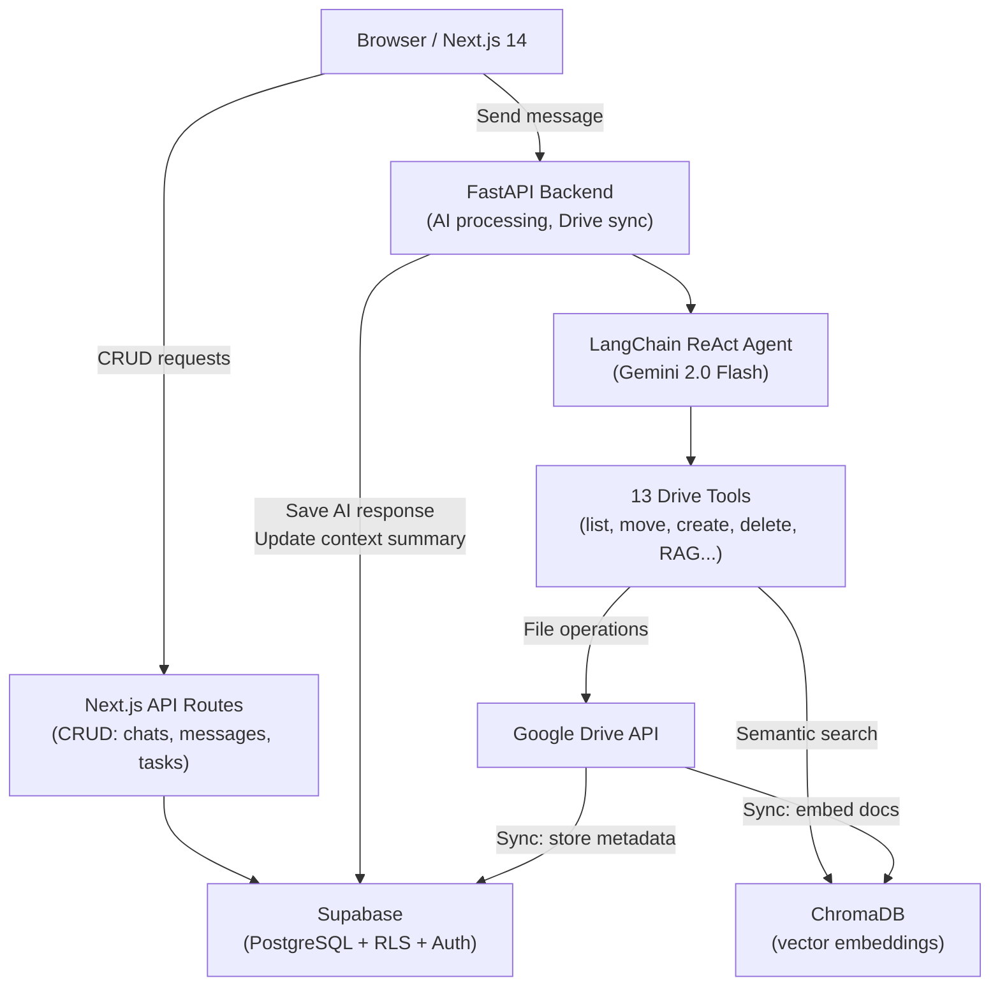

# Archyx AI

**Conversational AI for heritage archive management — ask questions, find documents, and organize Google Drive through natural language.**

🏆 **3rd place out of 18 teams — Opportunity Hack 2025 Summer**

[](LICENSE)
[](https://nextjs.org)
[](https://fastapi.tiangolo.com)
[](https://www.ohack.dev/hack/2025_summer)

---

## Quick Links

| | |
|---|---|
| Nonprofit partner | [Heritage Square Foundation](https://ohack.dev/nonprofit/QFPGmii2GmDPYrv5tjHA) |
| Hackathon | [2025 Summer Opportunity Hack](https://www.ohack.dev/hack/2025_summer) |
| Team Slack | [#genzents](https://opportunity-hack.slack.com/app_redirect?channel=genzents) |
| DevPost | [devpost.com/software/archyx-ai](https://devpost.com/software/archyx-ai) |
| Short demo | [youtube.com/watch?v=8onJQ87hVlE](https://www.youtube.com/watch?v=8onJQ87hVlE) |
| Deep dive | [youtube.com/watch?v=YvkvGeDqV2k](https://www.youtube.com/watch?v=YvkvGeDqV2k) |

---

## Overview

Archyx AI is a full-stack platform built for the [Heritage Square Foundation](https://ohack.dev/nonprofit/QFPGmii2GmDPYrv5tjHA) to make their Google Drive archive accessible through conversation. Volunteers and researchers can ask plain-English questions about document collections, get AI-generated answers sourced from actual files, and issue natural-language commands to reorganize folders — all without navigating complex directory trees or learning new tools.

The core technical challenge: connecting a chat interface to a live Google Drive through a LangChain ReAct agent that decides — per message — whether to do RAG retrieval, list folders, move files, suggest structure, or answer from memory.

### The Problem

Heritage organizations face a specific friction: valuable historical documents get buried in complex, poorly organized file structures. Volunteers new to the archive spend most of their time searching rather than doing actual research. Traditional keyword search fails on archaic terminology. There's no version control when files get moved or renamed. And the steep learning curve discourages engagement from younger volunteers.

Archyx AI's answer is a zero-training interface: if you can use a chat app, you can use this.

---

> **Recommended assets to add:** Screenshots of the chat interface, the folder structure viewer, and the admin dashboard would strengthen this README significantly.

---

## Highlights

- **LangChain ReAct agent with 13 tools (10 Google Drive API operations)** — dynamically decides whether to retrieve documents via RAG, traverse folders, create/move/rename files, or suggest reorganization plans, all within a single conversational turn.
- **Semantic search over Google Drive** — documents are chunked (500 tokens, 50 overlap), embedded with `gemini-embedding-001`, and stored in ChromaDB; queries retrieve by meaning, not keyword.
- **Git-like version control for Drive changes** — every folder/file operation (create, move, rename, delete) is recorded with before/after paths, grouped into versioned snapshots, and made rollback-ready.
- **Split compute architecture** — CRUD operations run as Next.js API routes for low latency; AI inference and Drive sync route through the FastAPI backend, keeping the frontend snappy.
- **Per-user context persistence** — chat context summaries are stored in Supabase and injected into each new prompt alongside user preferences (communication style, response length, custom system prompt).
- **Role-based Drive permissions enforced at the agent layer** — write tools (`MoveFile`, `CreateFolder`, `DeleteFile`, etc.) check a `permissions` column at invocation time, not just at the HTTP layer.

---

## Use Cases

| Use Case | User | Outcome |
|---|---|---|
| "Find all photos from the 1970s restoration project" | Volunteer | Semantic search surfaces relevant files across nested folders |
| "What is this collection about?" | Researcher | RAG retrieval answers from document content with source attribution |
| "Suggest a better folder structure for my archive" | Admin | Agent analyzes metadata and proposes an organized hierarchy |
| "Move all event flyers into a Marketing folder" | Admin (write permission) | Agent executes the reorganization and logs a versioned change record |
| Invite a new researcher and set their permissions | Admin | User management dashboard sends invite and assigns role |

---

## Features

**Chat & AI**
- Conversational interface backed by Gemini 2.0 Flash via a LangChain ReAct agent
- RAG pipeline: ChromaDB retrieval → Gemini answer generation with source documents
- Natural language command processing: `/organize`, `/search`, `/backup` and more
- Multi-modal support: text, images, PDFs, and document attachments
- Per-chat context summary persisted between sessions
- Per-user preferences (tone, length, custom system prompt) injected into every prompt
- Message reactions, edit, and export (JSON / Markdown / TXT)

**Google Drive Integration**
- Bi-directional sync: Drive → ChromaDB embeddings + Supabase metadata
- 13 agent-accessible tools: list, search, create, move, rename, delete, structure suggestions
- Conflict-aware change tracking with full audit log

**Version Control**
- Every Drive mutation is recorded with `change_type`, `original_path`, `new_path`, and timestamp
- Changes grouped into versioned snapshots; UI supports diff viewing and rollback

**User & Access Management**
- Three roles: Admin, Researcher, Volunteer
- Write-permission guard on all mutating Drive tools
- Supabase Row Level Security at the database layer
- Admin dashboard: invite users, monitor usage, manage permissions

**Background Processing**
- Async task queue (`task_processor`) for long-running file and embedding operations
- Real-time progress tracking with cancellation support

---

## Tech Stack

| Layer | Technology | Purpose |
|---|---|---|
| Frontend framework | Next.js 14 (App Router) | SSR, API routes, routing |
| Language | TypeScript | Type safety across frontend |
| Styling | Tailwind CSS + Radix UI (shadcn/ui) | Component library and design system |
| State management | Zustand | Persistent cross-session client state |
| Backend framework | FastAPI + Uvicorn | Async Python API for AI/sync workloads |
| AI model | Google Gemini 2.0 Flash | LLM for chat and embeddings |
| AI orchestration | LangChain (ReAct agent) | Tool routing, memory, RAG chain |
| Vector database | ChromaDB | Semantic document search |
| Embeddings | `gemini-embedding-001` | Document and query embeddings |
| Document loading | PyPDF2 + LangChain splitters | PDF extraction and chunking |
| Database + Auth | Supabase (PostgreSQL + RLS + JWT) | Data, auth, real-time subscriptions |
| File storage | Supabase Storage | Attachment handling |
| Drive integration | Google Drive API v3 + OAuth 2.0 | File operations and sync |
| Deployment | Vercel (frontend) + Render (backend) | Scalable hosting |

---

## Architecture



---

## How It Works

1. **User sends a message** — Next.js posts to the FastAPI `/api/messages/chat/{id}` endpoint with a JWT token.
2. **Context assembly** — `context_manager.py` fetches the chat's rolling context summary and the user's preferences from Supabase to construct the full prompt.
3. **Agent invocation** — A `GoogleDriveAgent` (LangChain ReAct) receives the prompt. It reasons across up to 100 iterations, selecting from 13 tools per turn.
4. **Tool execution** — Tools either query ChromaDB (semantic search / RAG), call the Google Drive API (list/move/create/delete), or fetch Supabase metadata. Write tools check permissions before acting and log every change to a versioned record.
5. **Response persistence** — The AI reply and updated context summary are written back to Supabase. Token usage and response time are tracked in chat metadata.
6. **Frontend update** — The Next.js client reads the saved message and renders it; background task progress (embeddings, sync) streams via Supabase real-time.

---

## Setup

### Prerequisites
- Node.js 18+ and pnpm
- Python 3.8+
- Supabase project (free tier works)
- Google AI API key (Gemini access)
- Google Drive service account with credentials JSON (for Drive integration)

### Frontend

```bash
cd frontend
pnpm install
cp .env.example .env.local
# Fill in .env.local — see required keys below
pnpm dev                  # http://localhost:3000
```

### Backend

```bash
cd backend
python -m venv .venv
# Windows:
.venv\Scripts\activate
# macOS/Linux:
source .venv/bin/activate

pip install -r requirements.txt
cp .env.example .env
# Fill in .env — see required keys below
python main.py            # http://localhost:8000
```

### Database

Run these SQL scripts in the Supabase SQL editor in order:

```
frontend/scripts/cleanup.sql        # reset schema (if needed)
frontend/scripts/setup-database.sql # create all tables
frontend/scripts/add-admin.sql      # seed first admin user
```

### Environment Variables

**`frontend/.env.local`**
```env
NEXT_PUBLIC_SUPABASE_URL=
NEXT_PUBLIC_SUPABASE_ANON_KEY=
NEXT_PUBLIC_SUPABASE_SERVICE_ROLE_KEY=
BACKEND_URL=http://localhost:8000
NEXT_PUBLIC_APP_URL=http://localhost:3000
NEXTAUTH_SECRET=
GMAIL_ID=                           # optional: for invite emails
GMAIL_APP_PASSWORD=
```

**`backend/.env`**
```env
SUPABASE_URL=
SUPABASE_ANON_KEY=
SUPABASE_SERVICE_ROLE_KEY=
GEMINI_API_KEY=
GOOGLE_CREDENTIALS_PATH=credentials.json  # optional: for Drive sync
HOST=0.0.0.0
PORT=8000
DEBUG=true
FRONTEND_URL=http://localhost:3000
```

### Lint / Type-check

```bash
# Frontend
pnpm lint
pnpm type-check

# Backend (no test suite configured; type hints enforced via Pydantic)
```

---

## Key Decisions

| Decision | Rationale | Tradeoff |
|---|---|---|
| LangChain ReAct agent over static routing | Archives are heterogeneous; the agent decides at runtime whether to search, list, or act — no fixed intent classification needed | Higher latency per turn; up to 100 reasoning iterations per message |
| ChromaDB + Gemini embeddings for RAG | Co-locating the embedding model with the generative model keeps representations consistent | Requires Gemini API key for both embedding and generation; no offline mode |
| Next.js API routes for CRUD, FastAPI for AI | Keeps compute-heavy operations on a separately scalable Python service; frontend CRUD stays fast | Two runtimes to deploy and coordinate |
| Supabase RLS + agent-layer permission checks | Defense in depth: DB-level RLS prevents unauthorized reads; agent-layer check surfaces a user-friendly error before hitting Drive | Slight duplication of authorization logic |
| Per-chat context summary (not full history replay) | Avoids sending entire message history to the model on every turn; summary is compressed and re-sent | Summary quality degrades for very long or topic-shifting conversations |
| Versioned change records for Drive mutations | Makes every folder operation auditable and reversible without a separate VCS | Storage cost scales with operation frequency |

---

## Innovation / Notable Work

**LangChain ReAct agent as an archive interface** — rather than fine-tuning a model on archival tasks, the agent composes existing Drive and RAG tools dynamically. A single natural-language message can trigger a multi-step plan: retrieve relevant metadata, suggest a folder structure, then execute moves — all in one turn.

**Chunk-header injection for retrieval accuracy** — each document chunk stored in ChromaDB is prefixed with `[File: {name} | Modified: {date} | Size: {mb}]`, so the retriever returns structured provenance alongside the text content without a separate metadata lookup.

**Heritage language handling** — prompt engineering accounts for archaic terminology and variant spellings common in historical archives, reducing hallucination on domain-specific queries.

**Resilient Drive API wrapper** — all write tools include retry logic and structured error responses (`{"error": "..."}`) that feed back into the agent's reasoning loop, allowing it to recover from transient failures or permission mismatches without crashing.

---

## Roadmap

- **Heritage-specific embedding model** — fine-tune on historical document corpora to improve retrieval of archaic language
- **Multi-organization support** — extend RLS schema and agent context to support federated archives across institutions
- **Real-time collaborative chat** — shared research sessions with live cursor presence via Supabase Realtime
- **Mobile app** — React Native client for field researchers capturing physical document metadata on-site
- **Streaming AI responses** — the streaming endpoint (`/chat/{id}/stream`) is stubbed; completing it would eliminate the current request-response latency feel

---

## Contributing

Contributions are welcome. See the live [contributor insights](https://github.com/2025-Arizona-Opportunity-Hack-Summer/GenZents-HeritageSquareFounda/graphs/contributors) for current activity. Please open an issue before submitting significant changes.

---

## Acknowledgments

- **[Heritage Square Foundation](https://ohack.dev/nonprofit/QFPGmii2GmDPYrv5tjHA)** — for partnering with us and providing real-world archival context
- **[Opportunity Hack](https://www.ohack.dev/hack/2025_summer)** — for organizing this volunteer-focused hackathon
- **Google AI** — for Gemini 2.0 Flash and the embedding APIs that power the intelligence layer
- **Supabase** — for the database, auth, and real-time infrastructure
- **Open source community** — LangChain, ChromaDB, Next.js, FastAPI, and every library this is built on

---

## About

Built in 60 days by Team GenZents for the [2025 Summer Opportunity Hack](https://www.ohack.dev/hack/2025_summer) in partnership with the Heritage Square Foundation. The project grew from a real problem: volunteers spending the majority of their time searching rather than researching. The goal was a zero-training-required interface — if someone can use a chat app, they can use this.

**Team GenZents:** [Aakash Khepar](https://github.com/ak-asu) · [Hartik Suhagiya](https://github.com/hartik123) · [Manas Dani](https://github.com/manasdani) · [Vuong Nguyen](https://github.com/vuong-ng) · [Waleed Alfar](https://github.com/waleedalfar)  
**Creator / Mentor:** Irtifaur Rahman

---

*Licensed under [MIT](LICENSE)*
